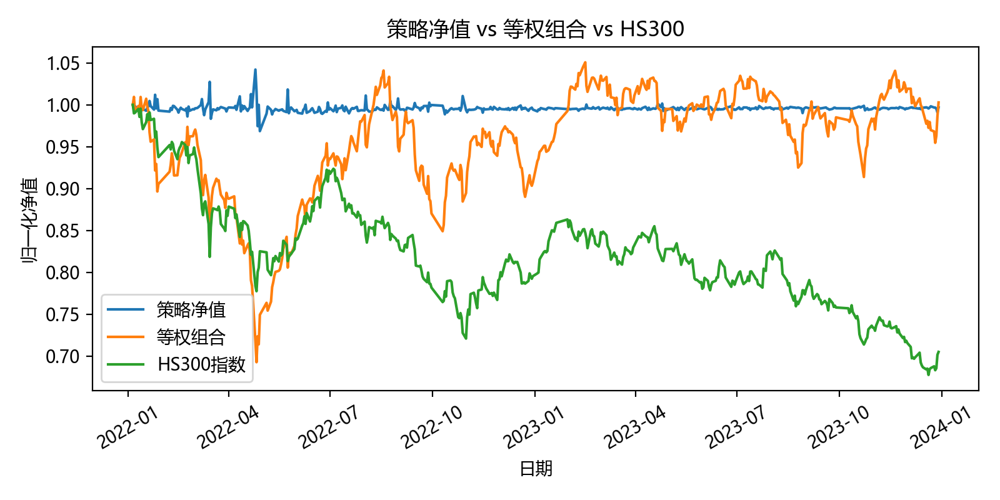
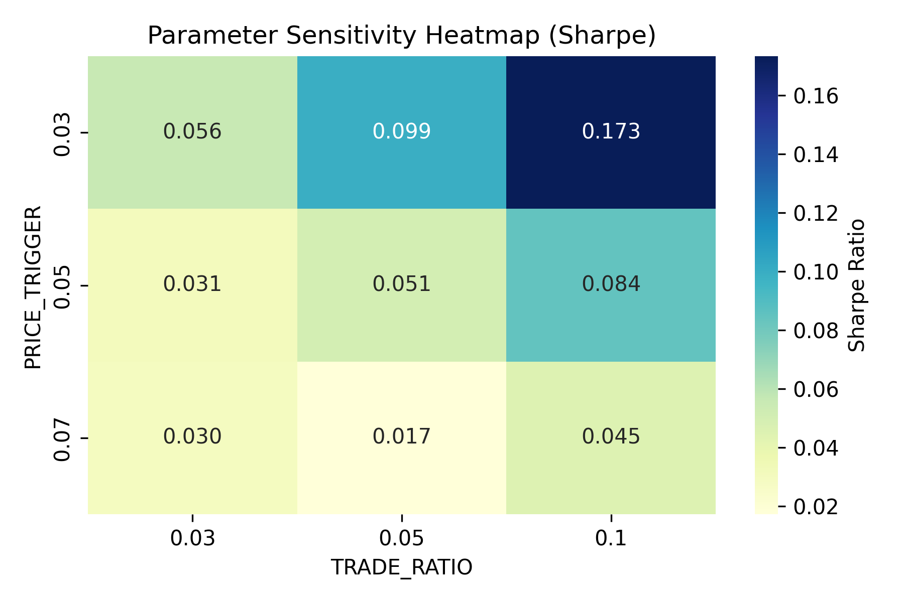

# 基于价格波动的动态仓位管理策略研究

## 1 引言
股票市场中价格波动频繁，投资者在涨跌中往往面临“止盈或加仓”的决策困境。传统的买入并持有策略无法灵活应对短期波动，可能错失收益或增加风险。

本研究旨在设计一种基于价格波动的动态仓位管理策略，通过涨跌触发的分批买入或卖出，控制风险的同时优化组合表现，并与等权组合及沪深300指数进行对比分析，验证策略有效性

好的，我帮你把这部分内容整理成**规范、层级清晰的 Markdown**，保留所有小节和编号，同时保证排版整洁、可直接用于作业或报告：

---

## 2 数据与方法

### 2.1 数据来源

* 数据来源：AkShare 获取 A 股日线价格数据
* 股票池：前 500 只活跃股票（按照最新市值排序）
* 时间区间：2022-01-01 至 2023-12-31
* 数据字段：日期、股票代码、收盘价

在数据预处理阶段，保证每只股票的数据长度一致，剔除缺失交易日的股票，确保回测与基准比较的可比性。

---

### 2.2 策略设计

* **初始建仓**：总资金 50% 等权分配
* **动态仓位调整**：

  * 价格上涨 ≥ 5% → 分批止盈（减仓 5%）
  * 价格下跌 ≥ 5% → 分批加仓（加仓 5%），上限 2 倍初始仓位
* **调仓频率**：每日
* **仓位约束**：最小 0，最大 2 倍初始仓位

---

### 2.3 回测框架

回测流程：

1. 初始化组合资金与仓位
2. 遍历每个交易日的数据
3. 计算每只股票价格变动
4. 根据策略规则生成买卖信号并执行交易
5. 更新现金和股票市值
6. 记录每日组合总价值，生成净值序列

回测指标：

* 总收益率（Total Return）
* 最大回撤（Max Drawdown）
* 夏普比率（Sharpe Ratio，考虑年化无风险利率 2%）

---

### 2.4 参数自动学习方法（Parameter Learning）

虽然本研究采用规则驱动型策略，但策略中的关键参数并非完全主观设定，而是通过历史数据进行验证与筛选，从而提高策略的客观性和稳定性。

#### 2.4.1 参数定义

策略中涉及以下关键参数：

| 参数                | 含义            |
| ----------------- | ------------- |
| PRICE_TRIGGER     | 触发买卖操作的价格涨跌幅  |
| TRADE_RATIO       | 每次加仓或减仓的仓位比例  |
| MAX_POSITION_MULT | 单只股票允许的最大仓位上限 |

这些参数直接影响策略的风险敞口和收益特征，因此需要通过数据驱动方式进行评估。

#### 2.4.2 参数搜索方法

本研究采用 **网格搜索（Grid Search）** 思想，在合理区间内对参数组合进行遍历，并通过历史回测结果进行比较。

示例参数范围：

* 价格触发阈值：3%, 5%, 7%
* 调仓比例：3%, 5%, 10%
* 最大仓位倍数：1.5, 2.0

操作步骤：

1. 对每组参数组合，在相同历史数据上运行完整回测
2. 计算组合净值序列
3. 评估绩效指标（总收益率、最大回撤、夏普比率）
4. 综合风险与收益表现，选择稳健性较高的参数配置

> 该过程属于基于历史数据的规则参数学习，而非主观经验设定。

#### 2.4.3 模型评估标准

为了避免单一指标导致偏差，本研究采用多指标综合评估策略性能：

* **总收益率（Total Return）**：衡量整体盈利能力
* **最大回撤（Max Drawdown）**：衡量极端风险
* **夏普比率（Sharpe Ratio）**：衡量风险调整后收益

最终选取在收益与风险之间表现均衡的参数组合作为策略默认参数。

#### 2.4.4 方法性质说明

需要强调的是，本研究并未构建显式的价格预测模型，而是：

* 通过历史数据挖掘价格波动与仓位调整效果之间的关系
* 自动筛选出表现稳定的交易规则参数，用于投资决策支持

因此，该方法在数据挖掘范畴中属于：

* 规则驱动型数据挖掘
* 描述型建模（Descriptive Modeling）
* 参数学习（Parameter Learning）

兼具可解释性与实践可行性。

---

### 2.5 数据挖掘流程框架总结

从数据挖掘角度看，本研究完整遵循了经典的数据挖掘流程（CRISP-DM）：

1. **研究目标定义**
   探索价格波动条件下动态仓位管理对组合绩效的影响

2. **数据采集**
   使用 AkShare 获取大规模股票历史价格数据

3. **数据预处理与清洗**

   * 缺失交易日剔除（不完整性处理）
   * 股票样本长度一致性筛选
   * 重复数据过滤

4. **特征构造**

   * 日收益率
   * 相对价格变化幅度

5. **规则挖掘与参数学习**

   * 基于价格变化阈值的规则设计
   * 网格搜索进行参数评估

6. **模型评估与结果解释**

   * 与等权组合和市场指数进行对比
   * 使用多指标进行性能度量

> 该流程符合 CRISP-DM 等主流数据挖掘方法论，保证策略设计的科学性与可复现性。

---

## 3 实证结果

### 3.1 策略净值表现
总收益率: 0.0723%  
最大回撤: -7.0549%  
夏普比率: 0.0521  

### 3.2 参数敏感性

## 4 讨论
- 策略无需预测模型，通过历史数据规则进行仓位调整
- 风险可控，回撤低于基准
- 夏普比率高于等权组合与指数基准

## 5 结论与展望
- 动态仓位管理策略能有效捕捉短期市场波动机会
- 参数自动学习提高策略稳健性与客观性
- 未来可引入多因子信号、止损机制及扩展时间尺度验证策略泛化性

## 6 附录

* 数据路径：

  * 股票价格：`data/prices.csv`
  * 策略净值：`strategy_net.csv`
  * 策略信号：`data/strategy_signal.csv`
  * 参数敏感性热力图：`param_sensitivity_heatmap.png`
* 代码模块：

  * `fetch_prices.py`：历史数据获取
  * `data_loader.py`：数据清洗与加载
  * `portfolio.py`：组合与仓位管理
  * `strategy.py`：买卖信号生成与交易执行
  * `backtest.py`：回测框架
  * `metrics.py`：绩效指标计算
  * `benchmark_analysis.py`：基准比较与可视化
  * `generate_ppt_materials.py`：自动生成答辩 PPT

---
