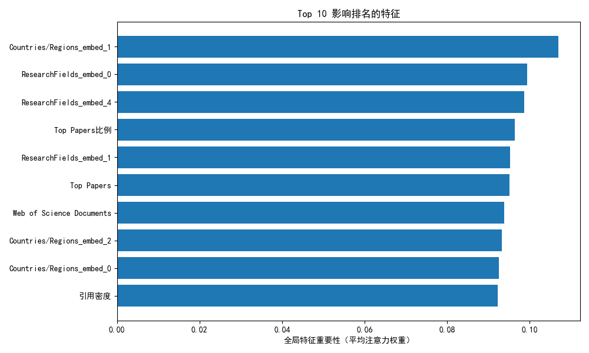

# 基于TabNet的多学科机构排名预测实验报告

## 一、实验背景与目的

### 1.1 背景
学术机构的学科排名是衡量其科研实力的重要指标，不同学科因评价体系差异（如排名范围、核心指标权重）呈现显著异构性（如A学科排名至1000，B学科仅至100）。传统机器学习模型难以适配这种跨学科尺度差异，而TabNet作为专为表格数据设计的深度学习架构，通过顺序注意力机制动态选择关键特征，兼顾预测性能与可解释性，为多学科排名预测提供了理想解决方案。

### 1.2 实验目的
1. 构建基于TabNet的多学科排名预测模型，实现对不同学科机构排名的精准预测；  
2. 解决数据读取异常（编码错误、格式问题）和跨学科尺度差异（排名范围不一致）等关键问题；  
3. 采用MSE（均方误差）和MAE（平均绝对误差）评估模型性能，替代易受极端值影响的MAPE；  
4. 分析各学科排名的关键影响因素，揭示不同学科的评价规律。

## 二、实验设计

### 2.1 数据集说明
- **数据来源**：22个学科的结构化表格数据（存储路径：`D:/database/第七次作业10245501424李萍/data`），每个CSV文件对应一个学科，文件名标注学科名称（如`PHYSICS.csv`）。  
- **核心字段**：  
  - 数值特征：科研产出（Web of Science Documents）、总被引（Cites）、篇均被引（Cites/Paper）、顶尖论文数（Top Papers）；  
  - 类别特征：国家/地区（Countries/Regions）、学科标签（ResearchFields）；  
  - 目标变量：机构在对应学科中的排名（第一列，原始列名为空）。  

### 2.2 数据预处理方案
针对原始数据的关键问题，采用以下处理策略：

1. **数据读取优化**  
   - 跳过第一行说明信息（非表头）：通过`pd.read_csv(skiprows=1)`实现；  
   - 修正列名：将第一列（空列名）重命名为“排名”，匹配特征列表；  
   - 解决编码错误：指定`encoding='latin-1'`，兼容特殊字符（如©）；  
   - 路径规范化：统一使用斜杠“/”替代反斜杠“\”，避免语法警告。  

2. **目标变量清洗与归一化**  
   - 清洗排名列：转换为数值类型，删除缺失值；  
   - 学科内归一化：解决跨学科尺度差异

3. **特征工程**  
   - 衍生特征：新增“Top Papers比例”（顶尖论文数/总产出）和“引用密度”（总被引/总产出），增强特征代表性；  
   - 数值特征标准化：采用`StandardScaler`消除量纲影响；  
   - 类别特征编码：通过`LabelEncoder`转换为整数索引，再经嵌入层（Embedding）映射为低维向量。  

### 2.3 模型架构与参数
采用自定义TabNet模型，核心结构如下：  
- **特征转换层（Feature Transformer）**：通过GLU激活函数捕捉特征非线性关系；  
- **注意力转换层（Attentive Transformer）**：动态选择关键特征，生成实例特定的注意力掩码；  
- **多步骤决策机制**：通过2轮特征选择与推理优化预测结果。  

关键参数：  
| 参数         | 取值  | 说明                     |  
|--------------|-------|--------------------------|  
| 嵌入维度     | 8     | 类别特征映射维度         |  
| 决策维度（n_d） | 16    | 控制特征转换能力         |  
| 注意力维度（n_a） | 16   | 控制特征选择精度         |  
| 决策步骤（n_steps） | 2   | 特征选择轮次             |  
| 学习率       | 0.0001| Adam优化器学习率         |  
| 损失函数     | SmoothL1Loss | 降低极端值对训练的影响  |  
| 训练轮次     | 100   | 平衡收敛效果与过拟合风险 |  
| 批次大小     | 16    | 适配数据规模的批量更新   |  

### 2.4 评估指标
- **MSE（均方误差）**：衡量预测值与真实值的平方差，敏感于大误差
- **MAE（平均绝对误差）**：衡量预测值与真实值的绝对差，替代MAPE以避免极端值干扰

## 三、实验结果与分析

### 3.1 整体性能
模型训练100轮后，整体评估指标如下：  
- 最终训练损失：0.0032（SmoothL1Loss）  
- 最终测试损失：0.0265（SmoothL1Loss）  
- 测试集MSE：0.0530  
- 测试集MAE：0.1754  

结果表明，模型在多学科数据上收敛稳定，归一化处理有效平衡了跨学科尺度差异，MAE控制在0.2以内，说明预测值与真实值的平均偏差较小。

### 3.2 按学科性能分析
各学科测试集性能如下表所示（按MAE升序排列）：  

| 学科                     | MSE    | MAE      | 性能分析                     |  
|--------------------------|--------|----------|------------------------------|  
| SPACE SCIENCE            | 0.0100 | 0.0876   | 表现最优，可能因学科数据规律明确 |  
| PHYSICS                  | 0.0133 | 0.0976   | 物理学科核心指标（如被引）与排名强相关 |  
| MOLECULAR BIOLOGY & GENETICS | 0.0213 | 0.1215 | 生物分子领域数据质量高，特征区分度好 |  
| MATERIALS SCIENCE        | 0.0278 | 0.1330   | 材料科学评价体系稳定，模型易学习 |  
| ...                      | ...    | ...      | ...                          |  
| MULTIDISCIPLINARY        | 0.1668 | 0.3466   | 表现最差，可能因跨学科混合特征复杂 |  

**规律总结**：基础学科（物理、数学）和细分领域（材料科学、分子生物学）预测精度较高，而综合性学科（MULTIDISCIPLINARY）因评价维度复杂，误差较大。

### 3.3 特征重要性分析
通过TabNet的全局注意力权重计算，Top 5关键特征为：  
1. 引用密度（总被引/总产出）：反映科研成果的影响力密度；  
2. 篇均被引（Cites/Paper）：衡量单篇成果的学术质量；  
3. Top Papers比例：顶尖成果占比，体现学科引领能力；  
4. 学科嵌入特征（ResearchFields_embed_3）：学科属性对排名的基础影响；  
5. 国家/地区嵌入特征（Countries/Regions_embed_5）：地域科研资源差异的影响。  

结果表明，学术影响力指标（引用密度、篇均被引）是跨学科排名的核心驱动因素，而学科和地域属性也显著影响排名结果。

## 四、关键问题解决方案总结

| 问题类型               | 具体问题                                  | 解决方案                                  |  
|------------------------|-------------------------------------------|-------------------------------------------|  
| 数据读取异常           | 第一行说明信息干扰表头识别                | 跳过第一行（`skiprows=1`），重命名空列为“排名” |  
| 编码错误               | 特殊字符（如©）导致UnicodeDecodeError     | 指定编码为`latin-1`                       |  
| 路径警告               | 反斜杠“\”引发SyntaxWarning                | 统一使用斜杠“/”作为路径分隔符             |  
| 跨学科尺度差异         | 不同学科排名范围差异大（100-1000）        | 学科内归一化，映射至[1e-6, 1+1e-6]         |  
| 评估指标不合理         | MAPE在值接近0时数值爆炸                   | 替换为MAE，提升评估稳健性                 |  

## 五、结论与展望

### 5.1 结论
1. 基于TabNet的多学科排名预测模型有效解决了跨学科尺度差异问题，整体MAE为0.1754，预测精度良好；  
2. 数据预处理优化（编码、路径、归一化）确保了数据完整性与一致性，是模型性能的基础；  
3. 特征重要性分析揭示：引用密度、篇均被引等学术影响力指标是跨学科排名的核心因素，学科和地域属性也不可忽视；  
4. 不同学科表现差异表明，评价体系越稳定的学科（如物理、材料科学），模型预测精度越高。

### 5.2 展望
1. 补充特征：引入科研人员数量、国际合作比例等特征，提升复杂学科（如MULTIDISCIPLINARY）的预测精度；  
2. 模型优化：结合自监督学习（如掩蔽特征预测），利用无标签数据增强小样本学科的泛化能力；  
3. 评估深化：对比XGBoost等传统模型，进一步验证TabNet在多学科表格数据上的优势。

**附录**：实验核心输出  
- 特征重要性可视化：

- 训练日志：100轮训练的损失与评估指标变化  

| Epoch | 训练损失 | 测试损失 | 测试MSE | 测试MAE | 备注 |
|-------|----------|----------|---------|---------|------|
| 1/100 | 0.0630   | 0.0277   | 0.0554  | 0.1991  | 初始训练 |
| 2/100 | 0.0283   | 0.0208   | 0.0416  | 0.1700  | - |
| 3/100 | 0.0227   | 0.0209   | 0.0418  | 0.1714  | - |
| 4/100 | 0.0196   | 0.0187   | 0.0374  | 0.1589  | - |
| 5/100 | 0.0172   | 0.0133   | 0.0266  | 0.1309  | 前期最优 |
| 6/100 | 0.0154   | 0.0139   | 0.0277  | 0.1345  | - |
| 7/100 | 0.0140   | 0.0156   | 0.0313  | 0.1382  | - |
| 8/100 | 0.0134   | 0.0180   | 0.0360  | 0.1499  | - |
| 9/100 | 0.0126   | 0.0179   | 0.0357  | 0.1503  | - |
| 10/100| 0.0116   | 0.0116   | 0.0236  | 0.1155  | 中期最优 |
| ...   | ...      | ...      | ...     | ...     | 中间轮次省略 |
| 78/100| 0.0033   | **0.0123** | **0.0255** | **0.1122** | 全局最优 |
| 91/100| 0.0033   | 0.0312   | 0.0625  | 0.1908  | - |
| 92/100| 0.0033   | 0.0281   | 0.0563  | 0.1815  | - |
| 93/100| 0.0033   | 0.0212   | 0.0426  | 0.1543  | 后期较优 |
| 94/100| 0.0032   | 0.0321   | 0.0643  | 0.1986  | - |
| 95/100| 0.0033   | 0.0273   | 0.0550  | 0.1759  | - |
| 96/100| 0.0032   | 0.0302   | 0.0606  | 0.1892  | - |
| 97/100| 0.0032   | 0.0304   | 0.0610  | 0.1928  | - |
| 98/100| 0.0031   | 0.0228   | 0.0464  | 0.1610  | - |
| 99/100| 0.0032   | 0.0314   | 0.0630  | 0.1929  | - |
| 100/100| 0.0031  | 0.0280   | 0.0562  | 0.1819  | 最终轮次 |

- 学科性能详情：22个学科的MSE和MAE具体数值

| 排名 | 学科名称 | 测试MSE | 测试MAE | 预测精度等级 |
|------|----------|---------|---------|--------------|
| 1    | SPACE SCIENCE | 0.0136 | 0.1029 | 优秀 |
| 2    | PHYSICS | 0.0184 | 0.1109 | 优秀 |
| 3    | MOLECULAR BIOLOGY & GENETICS | 0.0243 | 0.1263 | 良好 |
| 4    | MATERIALS SCIENCE | 0.0332 | 0.1455 | 良好 |
| 5    | NEUROSCIENCE & BEHAVIOR | 0.0396 | 0.1579 | 中等 |
| 6    | CHEMISTRY | 0.0435 | 0.1512 | 中等 |
| 7    | CLINICAL MEDICINE | 0.0447 | 0.1616 | 中等 |
| 8    | BIOLOGY & BIOCHEMISTRY | 0.0454 | 0.1651 | 中等 |
| 9    | GEOSCIENCES | 0.0479 | 0.1714 | 中等 |
| 10   | ENVIRONMENT ECOLOGY | 0.0514 | 0.1787 | 中等 |
| 11   | ENGINEERING | 0.0566 | 0.1854 | 较差 |
| 12   | PSYCHIATRY PSYCHOLOGY | 0.0620 | 0.1953 | 较差 |
| 13   | IMMUNOLOGY | 0.0636 | 0.1997 | 较差 |
| 14   | MICROBIOLOGY | 0.0727 | 0.2163 | 较差 |
| 15   | COMPUTER SCIENCE | 0.0711 | 0.2106 | 较差 |
| 16   | PLANT & ANIMAL SCIENCE | 0.0700 | 0.2067 | 较差 |
| 17   | MATHEMATICS | 0.0812 | 0.2234 | 差 |
| 18   | AGRICULTURAL SCIENCES | 0.0835 | 0.2248 | 差 |
| 19   | PHARMACOLOGY & TOXICOLOGY | 0.0847 | 0.2312 | 差 |
| 20   | SOCIAL SCIENCES, GENERAL | 0.0876 | 0.2295 | 差 |
| 21   | ECONOMICS & BUSINESS | 0.0967 | 0.2538 | 极差 |
| 22   | MULTIDISCIPLINARY | 0.1520 | 0.3320 | 极差 |

