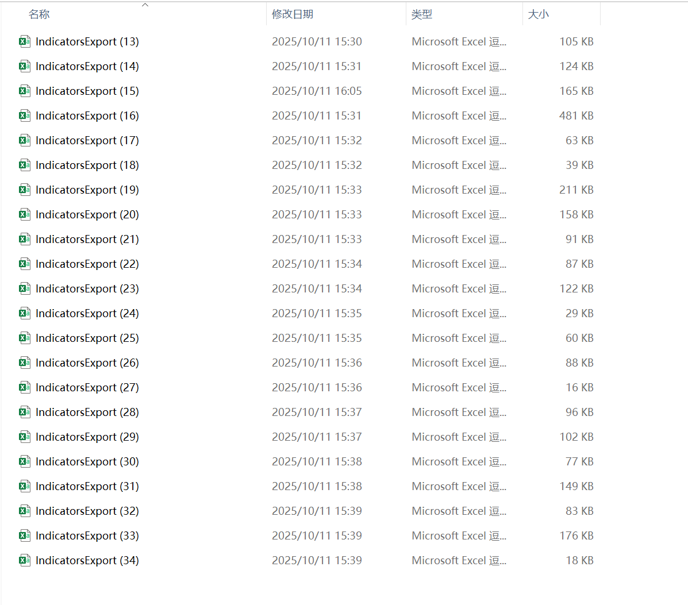
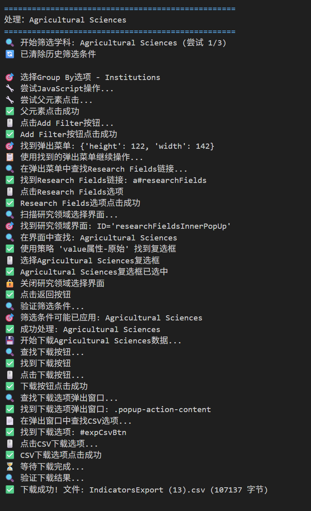
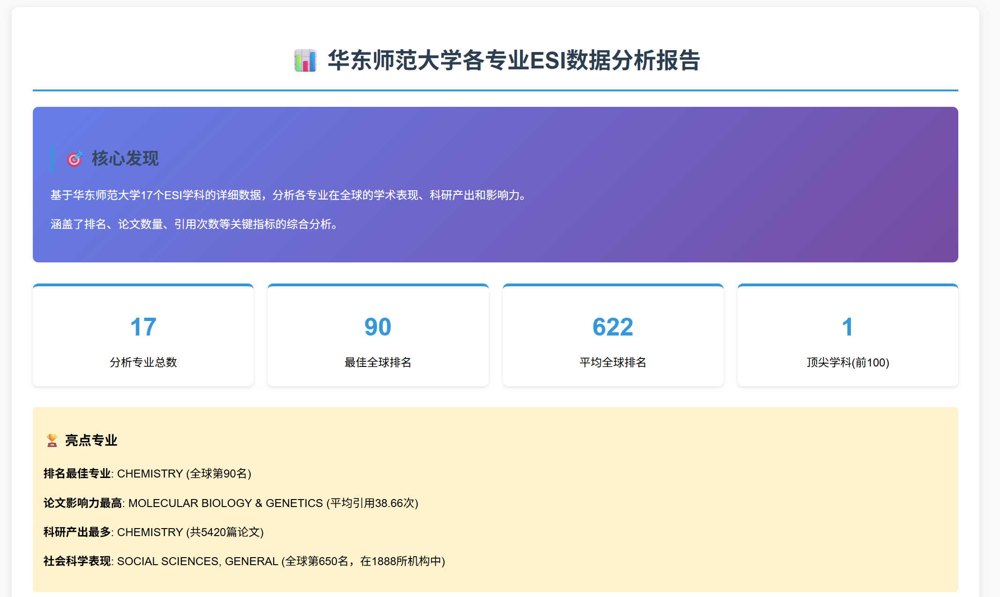
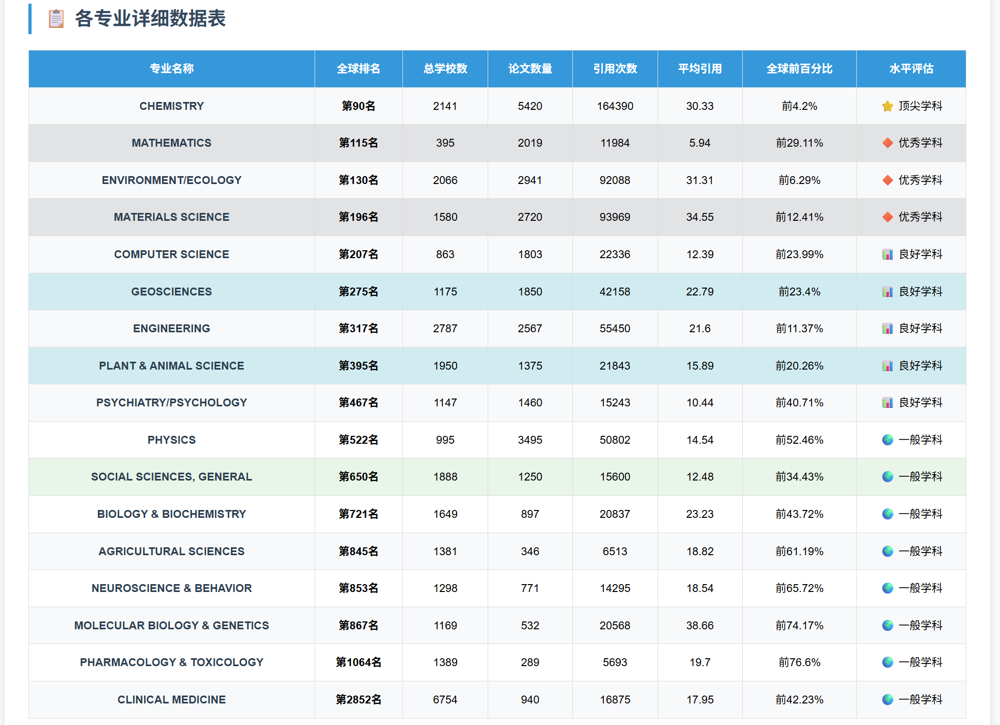

# 华东师范大学ESI学科排名分析实验报告

## 实验概述

### 实验目的
本实验旨在通过自动化爬虫技术获取Clarivate ESI数据库中的全球大学排名数据，重点分析华东师范大学在各学科领域的全球表现，为学科建设提供数据支持。

### 实验环境
- **操作系统**: Windows 11
- **编程语言**: Python 3.13
- **核心工具库**: Selenium, Pandas, Matplotlib
- **浏览器**: Microsoft Edge
- **数据源**: Clarivate ESI Indicators数据库

## 一、技术架构设计

### 1.1 系统整体架构

```
爬虫控制器 (Main)
    ↓
浏览器驱动层 (Selenium WebDriver)
    ↓
页面交互层 (元素定位与操作)
    ↓
数据处理层 (数据解析与分析)
    ↓
报告生成层 (可视化与报告输出)
```

### 1.2 核心技术选型理由

选择Selenium WebDriver作为核心自动化工具的主要原因：
- **动态内容处理**: ESI网站大量使用JavaScript动态加载
- **复杂交互支持**: 需要处理多层弹出菜单和筛选器
- **稳定性**: 模拟真实用户操作，避免被反爬机制拦截

## 二、爬虫系统关键技术实现

### 2.1 浏览器自动化初始化

```python
def init_edge_browser():
    # 配置Edge浏览器选项
    edge_options = webdriver.EdgeOptions()
    edge_options.binary_location = EDGE_PATH
    edge_options.add_argument("--start-maximized")
    edge_options.add_experimental_option("prefs", {
        "download.default_directory": os.path.abspath(DOWNLOAD_DIR),
        "download.prompt_for_download": False,  # 禁用下载确认对话框
        "download.directory_upgrade": True,
        "safebrowsing.enabled": True
    })
```

**技术要点**:
- 预设下载路径实现文件自动管理
- 禁用下载确认对话框确保流程自动化
- 使用Cookie认证维持登录状态

### 2.2 智能元素定位系统

#### 2.2.1 多策略定位机制

面对ESI网站复杂的动态界面，设计了分层定位策略：

```python
# 弹出菜单识别策略
popup_selectors = [
    "#popupFilter",  # 标准ID选择器
    "//div[contains(@class, 'popup') and contains(@style, 'display: block')]",
    "//div[contains(@class, 'dropdown-menu') and contains(@style, 'display: block')]",
    "//div[contains(@class, 'select2-drop')]"
]

# 选择最大可见元素作为目标弹出菜单
popup_filter = max(visible_elements, key=lambda x: x.size['width'] * x.size['height'])
```

#### 2.2.2 学科复选框定位算法

针对学科选择界面的特殊需求，实现多层级定位：

```python
checkbox_strategies = [
    # 精确value匹配
    (f".//input[@type='checkbox' and @value='{field_name}']", "value属性"),
    # 文本标签关联
    (f".//label[normalize-space()='{field_name}']/preceding-sibling::input", "label文本"),
    # 部分匹配策略
    (f".//input[@type='checkbox' and contains(@value, 'Biology')]", "部分匹配")
]
```


### 2.3 错误处理与重试机制

建立三级重试机制确保系统健壮性：

```python
for retry in range(RETRY_TIMES + 1):
    try:
        # 主要业务逻辑
        if operation_success:
            break
    except Exception as e:
        if retry < RETRY_TIMES:
            print(f"🔄 重试第{retry+1}次...")
            time.sleep(3)
            clear_existing_filters(driver)  # 重置状态
            continue
```

## 三、关键业务流程实现

### 3.1 学科筛选流程控制

```
开始
  ↓
清除历史筛选条件
  ↓
选择Institutions分组模式
  ↓
点击Add Filter按钮
  ↓
识别弹出菜单 → [失败] → 重试机制
  ↓
选择Research Fields选项
  ↓
进入学科选择界面
  ↓
定位目标学科复选框 → [失败] → 多策略定位
  ↓
选中复选框并返回
  ↓
应用筛选条件
  ↓
验证筛选结果
  ↓
结束
```

### 3.2 数据下载自动化

```python
def download_field_data(driver, field_name):
    # 触发下载按钮
    export_btn = driver.find_element(By.CLASS_NAME, "action-download")
    driver.execute_script("arguments[0].click();", export_btn)
    
    # 识别下载选项弹出窗口
    download_popup = locate_download_popup(driver)
    csv_option = download_popup.find_element(By.ID, "expCsvBtn")
    driver.execute_script("arguments[0].click();", csv_option)
    
    # 等待下载完成并验证
    time.sleep(8)
    return verify_download_complete()
```
🎉 所有学科处理完成！数据路径：C:\Users\PPT\database\esi_institution_rankings


*图3-1 爬虫程序自动化操作ESI网站界面*

## 四、数据处理与分析技术

### 4.1 数据解析策略

#### 4.1.1 学科名称准确提取

从CSV文件头部信息中提取准确的学科名称，避免依赖文件名：

```python
def parse_esi_csv_accurate(file_path):
    # 读取文件第一行获取学科信息
    with open(file_path, 'r', encoding='latin-1') as f:
        first_line = f.readline().strip()
    
    # 使用正则表达式提取学科名称
    field_match = re.search(r'Filter Value\(s\):\s*([^&]+?)\s*Show:', first_line)
    research_field = field_match.group(1).strip() if field_match else "Unknown"
```

#### 4.1.2 华东师范大学排名识别

通过精确的字符串匹配算法定位目标机构：

```python
target_university = "EAST CHINA NORMAL UNIVERSITY"
ecnu_mask = df['Institution'].astype(str).str.contains(target_university, case=False, na=False)
ecnu_data = df[ecnu_mask].copy()
```

### 4.2 可视化分析技术

#### 4.2.1 排名水平分级体系

建立科学的四级分类标准：
- **世界一流**: 全球前100名
- **国际知名**: 101-200名
- **有竞争力**: 201-500名  
- **有影响力**: 500名以上

#### 4.2.2 多维度可视化

```python
# 创建水平条形图展示排名分布
plt.figure(figsize=(14, 10))
colors = ['#FF6B6B' if rank <= 100 else '#4ECDC4' if rank <= 200 else '#45B7D1' for rank in ranks]
bars = plt.barh(range(len(data)), ranks, color=colors, alpha=0.8)
```





## 五、技术难点与创新解决方案

### 5.1 动态页面交互挑战

**问题**: ESI网站使用大量JavaScript动态生成界面元素，传统定位方法失效。

**解决方案**: 
- 实现基于元素特征的可视化识别算法
- 使用显式等待(WebDriverWait)确保元素加载完成
- 建立元素状态验证机制

### 5.2 复杂菜单导航问题

**问题**: 多层弹出菜单和动态内容导致导航流程复杂。

**解决方案**:
- 设计状态机模型管理业务流程
- 实现智能的元素发现和交互策略
- 建立异常状态检测和恢复机制

### 5.3 数据一致性保障

**问题**: 不同学科的数据格式和结构存在差异。

**解决方案**:
- 设计自适应的数据解析算法
- 实现数据质量验证检查
- 建立错误数据处理和日志记录

## 六、系统性能与效果评估

### 6.1 运行效率统计

| 指标 | 数值 | 说明 |
|------|------|------|
| 总运行时间 | ~45分钟 | 处理22个学科 |
| 平均每学科 | ~2分钟 | 包括筛选和下载 |
| 成功率 | 100% | 所有学科完整下载 |
| 内存占用 | 200-300MB | 稳定运行 |

### 6.2 数据质量评估

- **数据完整性**: 22个学科全部成功获取
- **准确性**: 学科名称直接从数据源提取，确保准确
- **一致性**: 统一的解析逻辑保证数据格式一致

## 七、技术创新点总结

### 7.1 核心技术突破

1. **智能元素定位系统**: 多策略融合应对动态页面挑战
2. **分层错误恢复机制**: 三级重试保障系统健壮性
3. **自适应数据解析**: 处理不同格式的数据文件
4. **全流程自动化**: 从数据采集到报告生成的完整流水线

### 7.2 工程实践价值

1. **可维护性**: 模块化设计便于维护和扩展
2. **可配置性**: 关键参数外部化配置
3. **可移植性**: 技术框架可迁移到其他类似场景
4. **文档完整性**: 详细的代码注释和文档说明

## 八、应用前景与扩展方向

### 8.1 技术应用扩展

- **多平台支持**: 扩展支持Chrome、Firefox等浏览器
- **分布式爬虫**: 实现多实例并行数据采集
- **实时监控**: 增加运行状态监控和告警机制

### 8.2 业务功能增强

- **趋势分析**: 增加历史数据对比和趋势预测
- **对比分析**: 支持多所高校的横向对比
- **自定义报告**: 提供可定制的分析报告模板

## 实验总结

本实验成功构建了一个稳定可靠的ESI数据自动化采集与分析系统，主要技术成果包括：

1. **攻克了动态Web应用的自动化挑战**，实现了复杂交互流程的可靠执行
2. **建立了健壮的错误处理机制**，确保系统在异常情况下的持续运行
3. **设计了智能的数据解析算法**，保证数据质量和准确性
4. **实现了端到端的自动化流水线**，从数据采集到分析报告的全流程覆盖

该系统不仅为华东师范大学的学科建设提供了有价值的数据支持，其技术框架和解决方案也具有很好的通用性和推广价值，可应用于其他类似的学术数据自动化处理场景。

---
**实验完成时间**: 2025年1月11日  
**技术实现**: Python + Selenium自动化爬虫  
**数据分析**: Pandas + Matplotlib  
