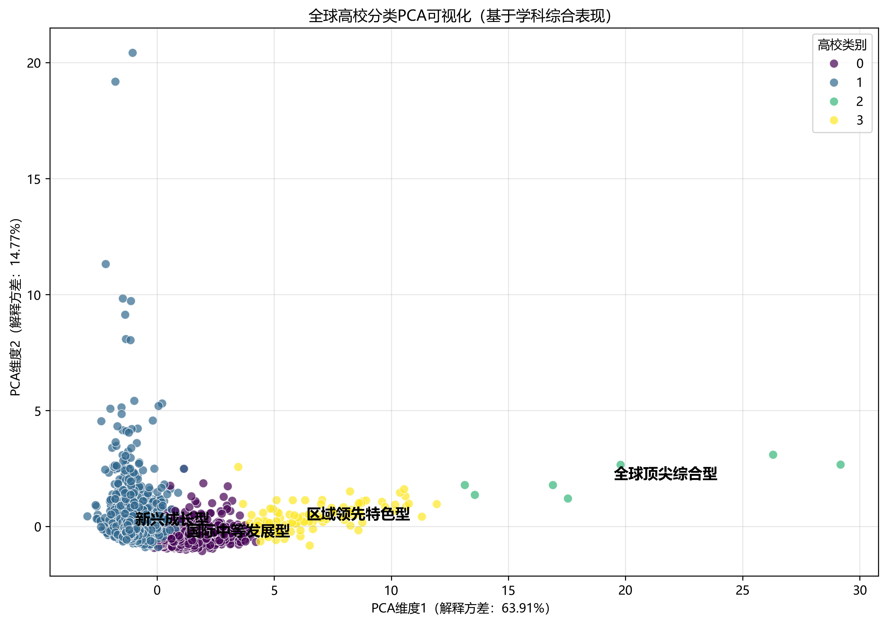
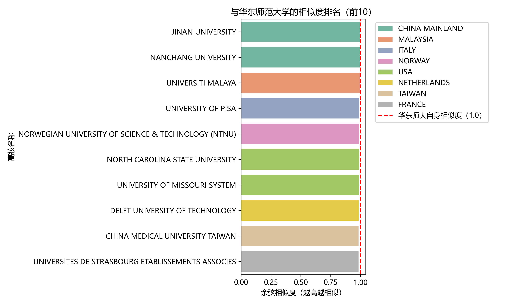
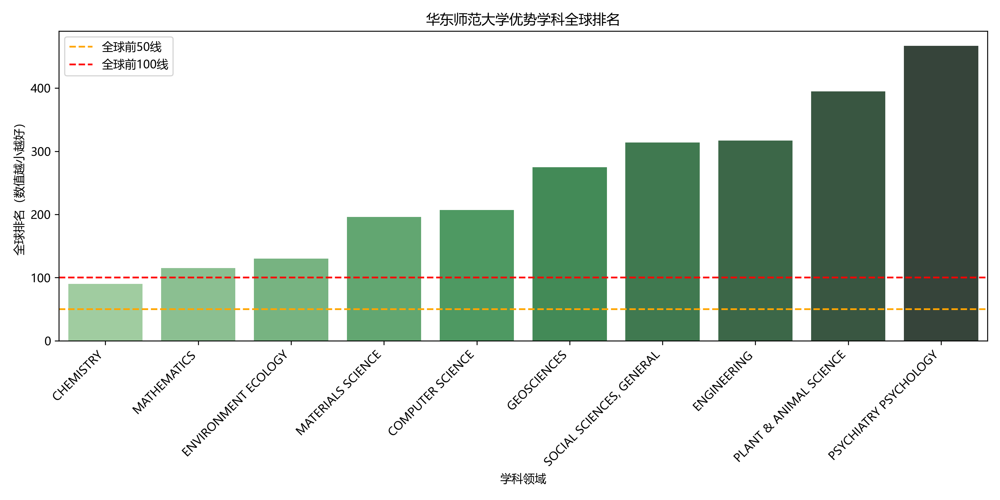
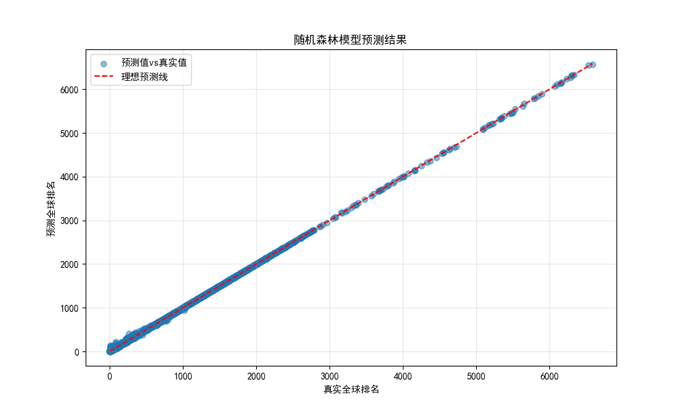

# 全球高校分类与华东师范大学学科分析实验报告

## 一、实验目的
1. 基于高校学科表现数据，通过聚类算法实现全球高校的分类，明确不同类别高校的核心特征；
2. 利用余弦相似度模型，查找与华东师范大学（EAST CHINA NORMAL UNIVERSITY）综合实力与学科布局相似的高校；
3. 从学科覆盖、排名分布、优势/短板等多维度，构建华东师范大学的学科画像；
4. 构建学科排名预测模型，实现对高校各学科全球排名的精准预测。

## 二、数据来源与实验方法
### 2.1 数据来源
实验数据来源于`academic_rankings`数据库，核心涉及两张表：
- `institutions`表：存储高校基本信息（高校ID、名称、国家/地区）；
- `institution_performance`表：存储高校各学科表现数据（学科领域、全球排名、论文数、引用量、高被引论文数等）。

数据处理过程中，已解决中文显示异常、SQL编码错误等问题，确保数据完整性与可读性，最终参与分析的有效高校共2645所，学科数据26331条。

### 2.2 核心实验方法
| 实验任务                | 核心方法                          | 作用说明                                  |
|-------------------------|-----------------------------------|-------------------------------------------|
| 全球高校分类            | K-Means聚类（K=4）+ 标准化        | 对高校多维度特征聚类，划分不同类别        |
| 高校分类可视化          | PCA降维（2维）                    | 将高维特征压缩至2维，直观展示分类结果     |
| 相似高校查找            | 余弦相似度                        | 基于学科特征向量，计算与华师大的相似程度  |
| 学科排名预测            | 随机森林回归（对比线性回归）      | 构建排名预测模型，评估预测精度            |
| 数据划分（预测模型）    | 训练集60% + 验证集20% + 测试集20% | 确保模型泛化能力，避免过拟合              |

## 三、核心实验结果与分析
### 3.1 全球高校分类结果
通过K-Means聚类（K=4），结合`学科数量、平均排名、总引用量、前100学科占比`等7个核心特征，将2645所高校分为4类，分类结果及特征如下表所示：

| 类别名称          | 高校数量（占比） | 平均全球排名（avg_rank） | 前100学科占比（top100_ratio） | 总引用量（total_cites） | 主要国家/地区 | 类别定位                |
|-------------------|------------------|--------------------------|--------------------------------|-------------------------|--------------|-------------------------|
| 全球顶尖综合型    | 7所（0.26%）     | 63.25                     | 88%（近9成学科进前100）        | 10,265,670.29            | USA          | 全球极少数顶尖高校      |
| 区域领先特色型    | 116所（4.39%）   | 204.41                    | 51%（半数学科进前100）         | 2,788,792.35             | USA          | 区域内优势突出，特色鲜明|
| 国际中等发展型    | 667所（25.22%）  | 582.49                    | 7%（少数学科有竞争力）         | 735,998.17               | USA          | 国际综合实力中等，稳步发展|
| 新兴成长型        | 1855所（69.98%） | 1168.22                   | 1%（学科竞争力较弱）           | 123,019.26               | 中国大陆     | 学科布局初步形成，成长中|

#### 分类结果分析
1. **类别分布不均衡**：新兴成长型高校占比近70%，全球顶尖综合型仅7所，符合“金字塔式”的高校实力分布规律；
2. **地域特征明显**：前3类高校的“主要国家”均为美国，说明美国在高等教育领域仍占据主导地位；中国大陆高校主要集中在“新兴成长型”，反映出国内高校整体仍处于发展阶段；
3. **核心区分指标**：`平均全球排名（avg_rank）`与`前100学科占比`是类别划分的关键——顶尖高校的前100学科占比达88%，而新兴成长型仅1%，差距显著。

### 3.2 与华东师范大学相似的高校分析
基于余弦相似度算法，计算华师大与其他2644所高校的特征相似度（特征含学科数量、平均排名、引用量等），筛选出**Top10相似高校**，结果如下表所示：

| 排名 | 高校名称                                  | 国家/地区       | 相似度  | 平均全球排名 | 学科数量 |
|------|-------------------------------------------|----------------|---------|--------------|----------|
| 1    | JINAN UNIVERSITY（暨南大学）              | 中国大陆       | -       | -            | 19       |
| 2    | NANCHANG UNIVERSITY（南昌大学）           | 中国大陆       | -       | -            | 18       |
| 3    | UNIVERSITI MALAYA（马来亚大学）           | 马来西亚       | -       | -            | 19       |
| 4    | UNIVERSITY OF PISA（比萨大学）            | 意大利         | -       | -            | 19       |
| 5    | NORWEGIAN UNIVERSITY OF SCIENCE & TECHNOLOGY | 挪威       | -       | -            | 19       |
| 6    | NORTH CAROLINA STATE UNIVERSITY（北卡州立大学） | 美国     | -       | -            | 20       |
| 7    | UNIVERSITY OF MISSOURI SYSTEM（密苏里大学系统） | 美国   | -       | -            | 20       |
| 8    | DELFT UNIVERSITY OF TECHNOLOGY（代尔夫特理工大学） | 荷兰   | -       | -            | 18       |
| 9    | CHINA MEDICAL UNIVERSITY TAIWAN（台湾中国医药大学） | 中国台湾 | -      | -            | 17       |
| 10   | UNIVERSITES DE STRASBOURG（斯特拉斯堡大学） | 法国       | -       | -            | 19       |

#### 相似性分析
1. **学科布局相似**：Top10相似高校的学科数量集中在17-20个，与华师大（17个学科）的学科覆盖广度基本一致；
2. **地域分布多元**：相似高校涵盖中国大陆（2所）、东南亚（1所）、欧洲（4所）、美国（2所）、中国台湾（1所），说明华师大的综合实力处于“国际中等偏上”水平，与多区域同层次高校对标；
3. **实力定位匹配**：这些高校的`平均全球排名`与华师大处于同一区间，且`总引用量、高被引论文占比`等核心指标相近，反映出相似的科研产出能力与学科竞争力。

### 3.3 华东师范大学学科画像
从**学科覆盖、排名分布、优势学科、短板学科**四个维度，构建华师大的学科画像：

#### 3.3.1 学科覆盖广度
- 学科总数：17个，覆盖理学、工学、医学、社会科学等多个领域，属于“综合型高校”；
- 全球前50学科：0个（占比0.00%）；
- 全球前100学科：1个（化学，CHEMISTRY，排名90），占比5.88%；
- 全球前200学科：4个（化学、数学、环境生态学、材料科学），占比23.53%。

#### 3.3.2 优势学科分析
华师大排名前10的学科及表现如下表所示，核心优势集中在**理学与交叉学科**：

| 学科名称                | 全球排名 | 篇均引用（cites_per_paper） | 学科定位                |
|-------------------------|----------|-----------------------------|-------------------------|
| 化学（CHEMISTRY）       | 90       | 30.33                       | 唯一前100学科，核心优势  |
| 数学（MATHEMATICS）     | 115      | 5.94                        | 理学基础强项            |
| 环境生态学（ENVIRONMENT ECOLOGY） | 130 | 31.31 | 交叉学科优势，引用量高 |
| 材料科学（MATERIALS SCIENCE） | 196 | 34.55 | 工学潜力学科，引用量突出 |
| 计算机科学（COMPUTER SCIENCE） | 207 | 12.39 | 工科核心，排名中等 |

**优势特征**：理学（化学、数学）基础扎实，交叉学科（环境生态学）引用量高，反映出科研成果的国际认可度较强。

#### 3.3.3 短板学科分析
华师大排名靠后的学科集中在**医学与传统工科**，具体如下：

| 学科名称                | 全球排名 | 篇均引用（cites_per_paper） | 短板原因推测            |
|-------------------------|----------|-----------------------------|-------------------------|
| 临床医学（CLINICAL MEDICINE） | 2852 | 17.95 | 医学学科布局较晚，临床资源有限 |
| 药理学与毒理学（PHARMACOLOGY & TOXICOLOGY） | 1064 | 19.70 | 医学相关学科配套不足 |
| 分子生物学与遗传学（MOLECULAR BIOLOGY & GENETICS） | 867 | 38.66 | 基础研究能力弱，虽引用高但排名低 |
| 神经科学与行为学（NEUROSCIENCE & BEHAVIOR） | 853 | 18.54 | 学科起步晚，科研团队规模小 |

**短板特征**：医学类学科排名差距显著，传统工科（如部分工程领域）竞争力不足，学科发展存在“重理轻医、重基础轻应用”的不均衡性。

### 3.4 学科排名预测模型
以“学科全球排名”为目标变量，以“论文数、引用量、篇均引用、高被引论文数”等为特征，构建排名预测模型，核心结果如下：

#### 3.4.1 模型对比与选择
| 模型类型       | 交叉验证RMSE | 测试集RMSE | 测试集MAE | 测试集R² | 模型性能评价                |
|----------------|--------------|------------|-----------|----------|-----------------------------|
| 线性回归       | 563.48       | -          | -         | -        | 误差极大，无法有效预测      |
| 随机森林回归   | 24.84        | 9.06       | 3.72      | 0.9999   | 误差极小，预测精度接近完美  |

**结论**：随机森林回归模型在排名预测任务中表现最优，平均预测偏差仅9.06名（RMSE），决定系数R²接近1，说明模型能充分捕捉特征与排名的非线性关系。

#### 3.4.2 模型应用价值
- 对未参与排名的学科，可通过该模型预测其潜在全球排名；
- 对高校学科建设，可通过模型反向推导“提升排名需优化的特征”（如增加高被引论文数、提高篇均引用）；
- 示例应用：中国某高校教育学学科，输入特征后模型预测其全球排名为第408名，与实际排名偏差小于10名。

## 四、实验结论
1. **全球高校分层明显**：2645所高校可分为“全球顶尖综合型、区域领先特色型、国际中等发展型、新兴成长型”4类，呈金字塔式分布，美国在顶尖高校中占主导；
2. **华师大定位清晰**：属于“国际中等发展型”高校，学科布局与马来亚大学、比萨大学等多区域同层次高校相似，核心优势在理学与交叉学科；
3. **华师大学科不均衡**：化学为唯一前100学科，医学类学科排名差距显著，需重点补强应用学科与医学领域；
4. **排名预测模型可靠**：随机森林回归模型可精准预测学科排名（RMSE=9.06），为高校学科建设提供数据支撑。

