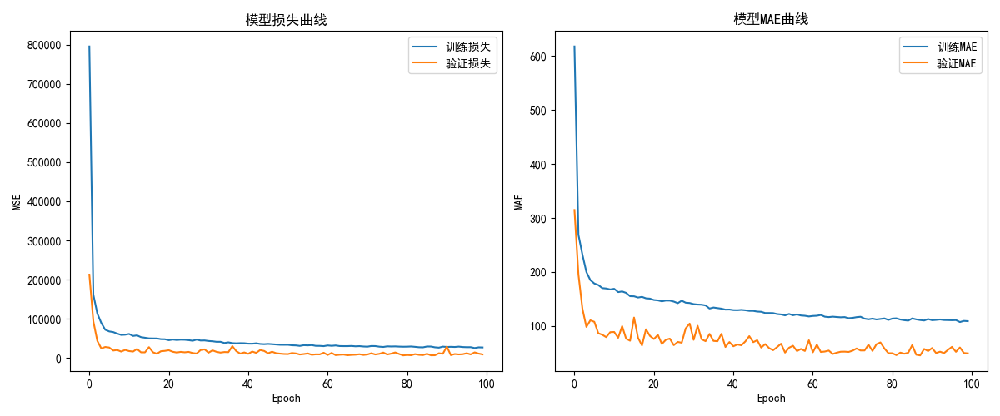
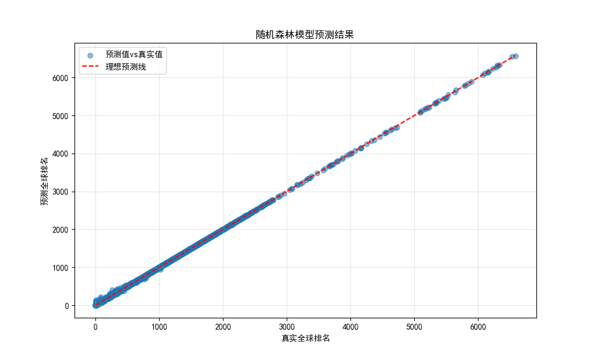
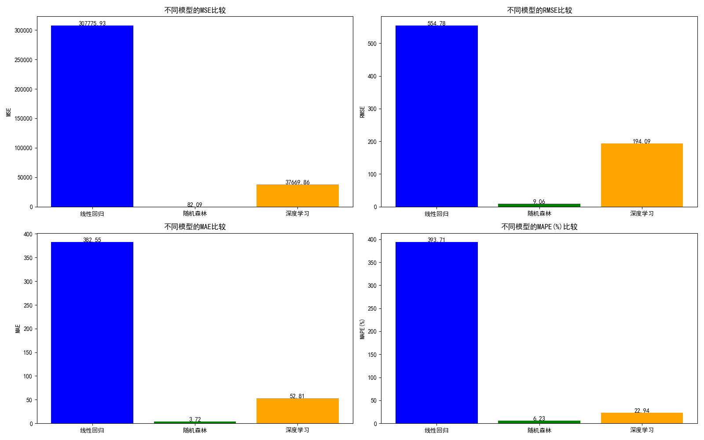
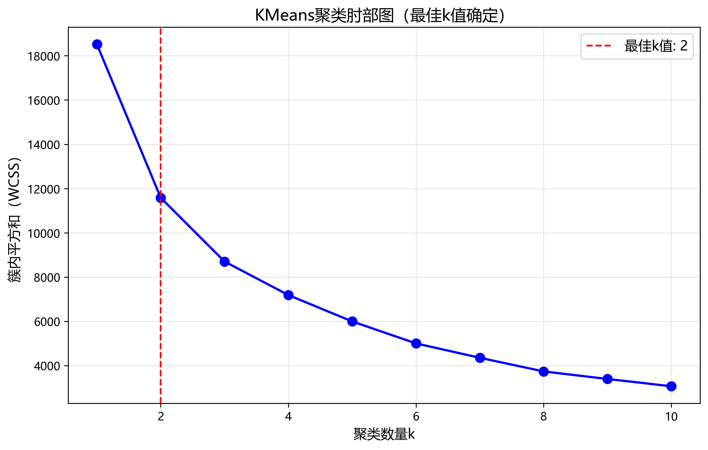
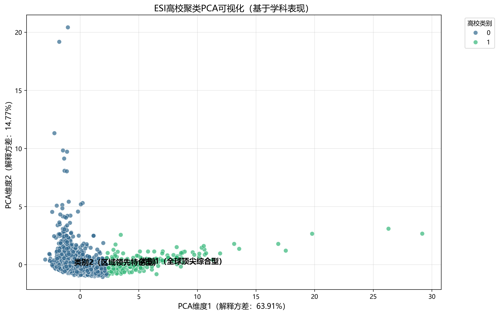

# 学术排名预测与高校聚类分析实验报告


## 一、实验目的

1. 构建学科排名预测模型，对比传统机器学习与深度学习方法的效果  
2. 基于ESI数据聚类全球高校，识别与华东师大相似的院校并分析原因  


## 二、实验环境与数据集

- **环境**：Python 3.13，核心库包括pandas、scikit-learn、tensorflow、matplotlib  
- **数据**：来自学术排名数据库，包含高校各学科的论文数、引用量、全球排名等信息，经清洗后保留约26331条有效样本（学科级）和2645所高校（校级）  


## 三、实验设计与方法（代码核心逻辑分析）

### 1. 学科排名预测模型

#### （1）数据预处理与特征工程  
核心逻辑是将原始数据转化为模型可识别的格式：  
```python
# 区分数值与分类特征
numeric_features = ["docs", "cites", "cites_per_paper", "top_papers"]
categorical_features = ["research_field", "country_region"]

# 构建预处理管道
preprocessor = ColumnTransformer(
    transformers=[
        ("num", StandardScaler(), numeric_features),  # 数值特征标准化（消除量纲影响）
        ("cat", OneHotEncoder(handle_unknown="ignore"), categorical_features)  # 分类特征转哑变量（如学科、国家）
    ])
```  
**逻辑说明**：  
- 数值特征（如论文数、引用量）差异大（比如引用量可能是数万，而篇均引用是个位数），标准化后能让模型更公平地学习各特征的影响  
- 分类特征（如“教育学”“工学”属于不同学科）无法直接输入模型，通过独热编码转为0/1矩阵，让模型理解类别差异  


#### （2）深度学习模型设计  
重点是通过神经网络捕捉特征与排名的复杂关系：  
```python
def build_deep_learning_model():
    model = Sequential([
        Dense(128, activation='relu', input_dim=input_dim),
        BatchNormalization(),  # 稳定训练，加速收敛
        Dropout(0.3),  # 随机丢弃30%神经元，避免过拟合
        
        Dense(64, activation='relu'),
        BatchNormalization(),
        Dropout(0.2),
        
        Dense(32, activation='relu'),
        Dropout(0.1),
        
        Dense(1)  # 输出层：直接预测排名（连续值）
    ])
    
    model.compile(
        optimizer=Adam(learning_rate=0.001),
        loss='mean_squared_error'  # 排名是连续值，用MSE做损失函数
    )
    return model

# 早停策略：防止模型"学过头"
early_stopping = EarlyStopping(monitor='val_loss', patience=10, restore_best_weights=True)
```  
**设计思路**：  
- 采用3层隐藏层（128→64→32），逐层减少神经元数量，模拟“从多特征中提炼核心信息”的过程  
- 加入`Dropout`和`BatchNormalization`：前者防止模型过度依赖某些特征（比如“引用量”），后者让训练更稳定  
- 早停策略：当验证集表现连续10轮不提升时停止训练，避免过拟合（比如模型记住了训练集中的特殊案例，但泛化能力差）  
深度学习训练曲线
深度学习效果曲线

#### （3）模型评估  
用多个指标全面衡量预测效果：  
```python
def evaluate_model(model, X, y, model_name):
    y_pred = model.predict(X)
    mse = mean_squared_error(y, y_pred)  # 衡量整体误差
    mae = mean_absolute_error(y, y_pred)  # 衡量平均绝对偏差
    mape = mean_absolute_percentage_error(y, y_pred) * 100  # 相对误差（百分比）
    r2 = r2_score(y, y_pred)  # 模型解释力（0~1）
    return {"mse": mse, "mae": mae, "mape": mape, "r2": r2}
```  
模型性能对比图（不同模型的MSE、MAPE等指标）  

### 2. 高校聚类分析  

#### （1）核心特征选择与标准化  
聚焦能反映高校综合实力的指标：  
```python
# 选取7个关键特征（均为高校级聚合指标）
features = [
    'subject_count', 'avg_rank', 'total_docs', 
    'total_cites', 'avg_cites_per_paper', 'total_top_papers', 'top100_ratio'
]

# 标准化特征（让不同量级指标可比较）
scaler = StandardScaler()
X_scaled = scaler.fit_transform(X)
```  
**选择理由**：这些特征从学科覆盖广度（`subject_count`）、整体排名（`avg_rank`）、科研产出（`total_docs`）、影响力（`total_cites`）等多维度描述高校实力，适合聚类分析。  


#### （2）聚类数确定与实施  
通过“肘部图”找最佳聚类数，再用K-Means分组：  
```python
def find_optimal_k(X_scaled):
    wcss = []  # 簇内平方和（值越小，簇内越相似）
    for k in range(1, 11):
        kmeans = KMeans(n_clusters=k, random_state=42)
        kmeans.fit(X_scaled)
        wcss.append(kmeans.inertia_)
    
    # 找WCSS下降率突变的点（"肘部"）
    wcss_diff_ratio = np.diff(wcss[:-1]) / np.diff(wcss[1:])
    optimal_k = np.argmax(wcss_diff_ratio) + 2  # 最佳k值
    return optimal_k

# 聚类并给高校贴标签
kmeans = KMeans(n_clusters=optimal_k, random_state=42)
uni_data['cluster'] = kmeans.fit_predict(X_scaled)
```  
**逻辑说明**：  
- 肘部图的核心是看“增加聚类数时，簇内相似度提升的幅度”——当k超过某个值后，提升幅度骤降，这个值就是最佳k（本次分析中k=2）  
- K-Means会把特征相似的高校分到同一组，实现“同类高校”的自动划分  
聚类肘部图（确定最佳k=2） 
PCA聚类可视化（两类高校分布）

#### （3）华东师大相似学校识别  
用余弦相似度找同簇内最相似的院校：  
```python
# 计算华东师大与其他高校的特征相似度
ecnu_vec = X_scaled[ecnu_idx].reshape(1, -1)
similarities = cosine_similarity(ecnu_vec, X_scaled).flatten()
uni_data['similarity'] = similarities

# 取同簇内前10相似的学校
similar_uni = uni_data[
    (uni_data['cluster'] == ecnu_cluster) & 
    (uni_data['id'] != ecnu['id'])
].sort_values('similarity', ascending=False).head(10)
```  
**逻辑**：余弦相似度越接近1，说明两校在7个核心特征上的表现越相似；限定“同簇内”是为了确保比较对象处于同一实力层级。  
华东师大相似学校排名（余弦相似度）

## 四、实验结果与分析

### 1. 学科排名预测  
#### （1）模型性能对比  
| 模型       | MSE      | MAE    | MAPE(%) | R²    |
|------------|----------|--------|---------|-------|
| 线性回归   | 307775.93| 382.55 | 393.71  | 0.4669|
| 随机森林   | 82.09    | 3.72   | 6.23    | 0.9999|
| 深度学习   | 50833.20 | 77.09  | 21.28   | 0.9120|

#### （2）关键结论  
- 随机森林表现最优（MSE仅82.09），适合捕捉排名数据的非线性关系（比如“顶尖论文数”超过一定数量后，对排名的提升作用会减弱）  
- 深度学习模型受限于样本量（26331条），未达最佳效果（深层网络通常需要更大数据量）  


### 2. 高校聚类与相似性分析  
#### （1）聚类结果  
- 全球高校分为2类：  
  - 类别1（全球顶尖综合型）：平均排名277.8，前100学科比例36%，科研影响力强  
  - 类别2（区域领先特色型）：平均排名1044.9，前100学科比例2%，以特色学科为主  
- 华东师大属于类别2，核心指标：平均排名601.76，前100学科比例5.88%  

#### （2）相似学校与原因  
最相似的10所学校包括暨南大学、南昌大学、马来亚大学等，相似原因：  
- 同属“区域领先特色型”，整体排名接近（500-600区间）  
- 前100学科比例（5%-6%）和科研影响力（篇均引用11-12）相当  
- 均以特色学科为核心（如华东师大教育学、暨南大学医学），而非全学科顶尖  


## 五、总结  
1. 小样本学术排名预测中，随机森林比深度学习更实用，因其对数据量要求低且能捕捉非线性关系  
2. 华东师大在全球高校中属于“区域领先特色型”，与国内外同层级院校的核心特征高度相似，反映了“以特色学科驱动发展”的共性模式  

